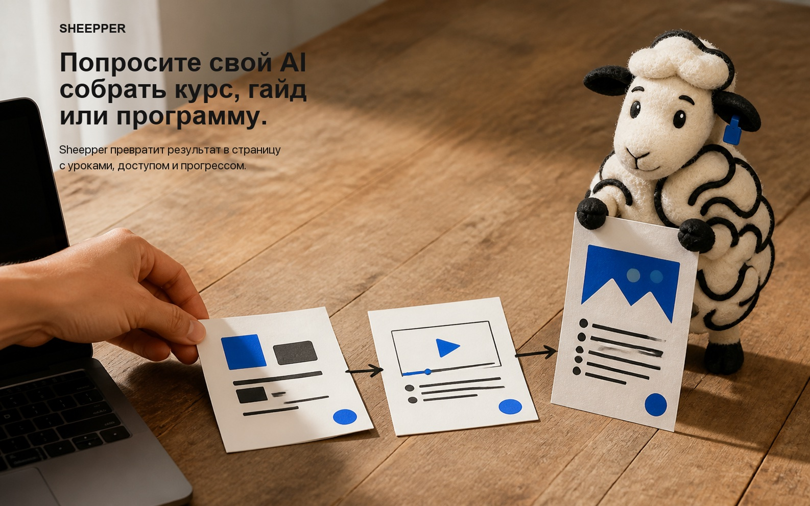

  
  
  
  

I'm Yerdaulet Damir, a product engineer and AI engineer based in Abu Dhabi, UAE. I have worked as a CTO / Technical Lead, full-stack engineer and AI product engineer, owning frontend, backend, AI agents, payments, cloud infrastructure, CI/CD and on-premise systems. I have built multi-provider AI platforms, multi-tenant sales agents, EdTech products, farm-operations software, GovTech regulatory-analysis tools and software connected to physical access hardware. I also teach AI-native development, host technical sessions and speak at technology events. Outside software, I have performed in theatre and recorded event invitations and character voices as a professional voice-over artist. I study AI Engineering at MBZUAI.

**[Reechy](https://reechy.cam)** — record, edit, publish and measure video without leaving the browser.

<table>
  <tr>
    <td width="50%" valign="top">
       
      <b>Gymmy</b> is a Telegram-native multimodal fitness agent with persistent workout state. Photo, voice and text update the same history; it notices when someone stops training, re-engages them without waiting for another prompt, and can roast missed sessions inside group chats. <a href="https://t.me/gymmybuddy_bot?start=landing">Try it</a>.
    </td>
    <td width="50%" valign="top">
       
      <b>CoolREADME</b> turns a GitHub profile into a customizable feed of live cards. Build project galleries, contribution stats, streak pets, profile heroes, social posts, music and media cards in the browser—or give Codex or Claude your GitHub link and let the agent compose the README. Every result is editable through its URL and ready to paste as Markdown. <a href="https://coolreadme.xyz/build?user=yerdaulet-damir">Build yours</a> · <a href="https://coolreadme.xyz/templates">all cards</a>.
    </td>
  </tr>
</table>

## Open-source products and systems

[![Open-source products and systems](https://coolreadme.xyz/api/projects-gallery?user=yerdaulet-damir&projects=langgraph-sales-agent|Deployable+multi-tenant+AI+sales+agents+with+business+data,+tools+and+channels+already+wired.|Python|33|https://github.com/yerdaulet-damir/langgraph-sales-agent;;tgbuilder|Build,+run,+repair+and+edit+complete+Telegram+bots+from+a+Telegram+conversation.|TypeScript|1|https://github.com/yerdaulet-damir/tgbuilder;;awesome-solo-ai|Curated+tool+and+skill+library+for+building+one-person+AI+companies.|Markdown|18|https://github.com/yerdaulet-damir/awesome-solo-ai;;vibe-coding-rules|54+production+constraints+for+FastAPI,+Next.js+and+Go.|TypeScript|12|https://github.com/yerdaulet-damir/vibe-coding-rules;;openquiz|Open-source+Quizlet+and+Anki+alternative+for+learning+workflows.|TypeScript|11|https://github.com/yerdaulet-damir/openquiz;;json-vision|Virtualized+VS+Code+views+for+multi-GB+JSON.+1.9k+downloads.|TypeScript|4|https://open-vsx.org/extension/aimyerdaulet/json-vision&title=OPEN%20SOURCE%20PRODUCTS&theme=dark&accent=FBBF24&v=20260907d)](https://github.com/yerdaulet-damir?tab=repositories)

- **[LangGraph Sales Agent](https://github.com/yerdaulet-damir/langgraph-sales-agent)** — a deployable open-source base for AI sales agents. Start it locally, inspect and test the complete sales flow, connect a company's catalog and APIs, then launch on Telegram, Instagram, WhatsApp or the web. One deployment can serve multiple businesses while keeping each tenant's customers, products, brand, tools and model isolated.
- **[TGBuilder](https://github.com/yerdaulet-damir/tgbuilder)** — an AI Telegram bot builder that operates inside Telegram itself. Describe a booking, support or workflow bot in chat; it plans the behavior, writes and starts the code, checks that it stays alive, repairs crashes and applies later changes through the same conversation. One shared service runs every generated bot, while bot owners need no LLM API key.
- **[Awesome Solo AI](https://github.com/yerdaulet-damir/awesome-solo-ai)** — a tool and skill library for one-person AI companies: agent frameworks, research systems, coding tools, browser automation, media pipelines and distribution workflows. 18 stars and 10 forks.
- **[JSON Vision](https://open-vsx.org/extension/aimyerdaulet/json-vision)** — a VS Code extension that indexes JSONL byte offsets, reads only visible rows and virtualizes tables, posts, trees and schema graphs. An 84 MB, 72,143-line file indexes in about 80 ms; 1,944 Open VSX downloads. [Source](https://github.com/yerdaulet-damir/json-vision).
- **[OpenQuiz](https://github.com/yerdaulet-damir/openquiz)** and **[Lawnode](https://github.com/yerdaulet-damir/lawnode)** cover two different product domains: an open-source Quizlet/Anki alternative and regulatory contradiction detection with graph analytics and multilingual NLI.

## Systems against AI slop

- **[Redpen](https://github.com/yerdaulet-damir/redpen)** is an AI copywriting skill for landing pages, headlines, emails and launch content. It builds a truth ledger, identifies one reader's real situation, compares distinct arguments and rejects copy that is vague, invented or interchangeable with a competitor's.
- **[Hookmaxxing](https://github.com/yerdaulet-damir/hookmaxxing)** gives Codex, Claude and Hermes a repeatable system for hooks, titles and opening frames. Every hook needs one viewer, one argument, a truthful contrast, visible proof and a body that pays off the exact promise.
- **[Vibe Coding Rules](https://github.com/yerdaulet-damir/vibe-coding-rules)** handles the code side: 54 drop-in architecture rules for FastAPI, Next.js and Go that keep AI-generated products maintainable, testable and deployable after the prototype works.

## GitHub stats

<picture>
  <source media="(prefers-color-scheme: dark)" srcset="https://github-profile-summary-cards.vercel.app/api/cards/profile-details?username=yerdaulet-damir&amp;theme=github_dark&amp;animation=load&amp;duration=2">
  
</picture>

<table>
  <tr>
    <td width="50%">
      <picture>
        <source media="(prefers-color-scheme: dark)" srcset="https://github-profile-summary-cards.vercel.app/api/cards/stats?username=yerdaulet-damir&amp;theme=github_dark&amp;animation=load&amp;duration=2">
        
      </picture>
    </td>
    <td width="50%">
      <picture>
        <source media="(prefers-color-scheme: dark)" srcset="https://github-profile-summary-cards.vercel.app/api/cards/repos-per-language?username=yerdaulet-damir&amp;theme=github_dark&amp;animation=load&amp;duration=2">
        
      </picture>
    </td>
  </tr>
</table>

**[Sheepper](https://sheepper.link)** stores each course, guide or media library as one product record powering the block editor, storefront, access rules and learner view. The same product can be edited in the UI or through connected Codex and Claude agents.

## Tools I work with

**Languages and product stack**

  
  
  
  
  
  
  
  
  

**AI systems and agents**

  <picture><source media="(prefers-color-scheme: dark)" srcset="https://unpkg.com/@lobehub/icons-static-png@latest/dark/langgraph-text.png"></picture>&nbsp;&nbsp;
  <picture><source media="(prefers-color-scheme: dark)" srcset="https://unpkg.com/@lobehub/icons-static-png@latest/dark/openai-text.png"></picture>&nbsp;&nbsp;
  <picture><source media="(prefers-color-scheme: dark)" srcset="https://unpkg.com/@lobehub/icons-static-png@latest/dark/claude-text.png"></picture>&nbsp;&nbsp;
  <picture><source media="(prefers-color-scheme: dark)" srcset="https://unpkg.com/@lobehub/icons-static-png@latest/dark/gemini-text.png"></picture>&nbsp;&nbsp;
  <picture><source media="(prefers-color-scheme: dark)" srcset="https://unpkg.com/@lobehub/icons-static-png@latest/dark/chatglm-text.png"></picture>&nbsp;&nbsp;
  <picture><source media="(prefers-color-scheme: dark)" srcset="https://unpkg.com/@lobehub/icons-static-png@latest/dark/codex-text.png"></picture>&nbsp;&nbsp;
  <picture><source media="(prefers-color-scheme: dark)" srcset="https://unpkg.com/@lobehub/icons-static-png@latest/dark/claudecode-text.png"></picture>

**Data, infrastructure and delivery**

  
  
  
  
  
  

Greco-Roman wrestling · English, Kazakh and Russian · fiction, history and poetry.
